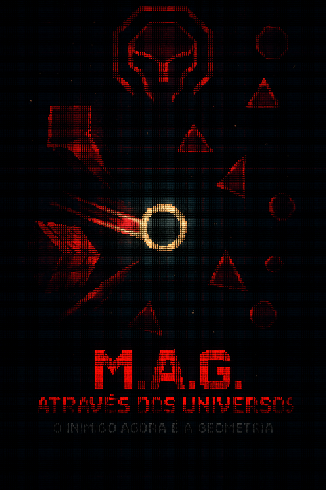

# 🌌  M.A.G. - Através dos Universos
<div align="center">
  
</div>

Após derrotar o Leviathan no clímax do primeiro jogo, Gronkarr, o guerreiro transformado em Peixe Cósmico, acreditava finalmente estar livre de sua sina. Mas em seu último suspiro, o Leviathan conjura um feitiço final — um rasgo na realidade que consome Gronkarr e o lança em um universo desconhecido.

Ele desperta... não mais como peixe, nem como guerreiro, mas como um fragmento de si mesmo: uma simples forma pixelada, um círculo luminoso flutuando em um mundo feito de linhas perfeitas, ângulos precisos e caos geométrico. Esse novo plano é o Universo Geométrico, onde a lógica é rei, e as formas têm vida própria.

Aqui, círculos colidem, quadrados esmagam, triângulos perfuram, e algo maior — muito maior — observa Gronkarr. Seu nome?
"Hexakron", o Encarregado da Simetria. Um ser colossal, feito de geometrias perfeitas, que rege esse universo como um Deus do Caos Ordenado. Seu único objetivo? Manter o equilíbrio... eliminando toda forma imperfeita como Gronkarr.

Agora, Gronkarr deve redescobrir seus poderes. Seus tiros antes líquidos tornaram-se esferas de energia pura. Seu corpo flui suavemente em dashes rápidos que distorcem o espaço. E sua mente, antes cheia de dúvidas, está agora conectada a uma inteligência superior que sussurra frases absurdas — mensagens vindas de outra dimensão, geradas por uma IA ancestral.

O caminho de volta para casa pode estar além da última forma... ou talvez ele nunca mais escape.

---
## ✨ Funcionalidades Especiais

- **Frases narrativas dinâmicas**: introdução, milestones de kills, dano, eventos de boss — tudo gerado pela IA Gemini.
- **Sem travamentos**: as frases são pré-carregadas e atualizadas em background.
- **Visual minimalista**: inspirado no jogo "O" do SirMilkman.

---

## 🧰 Requisitos

- **macOS, Linux ou Windows**
- Compilador C (gcc ou clang)
- [RayLib](https://www.raylib.com/) instalada
- Python 3.8+
- Conexão com a internet (para frases dinâmicas)
- Conta Google com acesso à API Gemini (pré-configurada no projeto)

---

🔑 Tutorial: Obter Chave API do Gemini
Para criar sua própria API gratuita do Google Gemini 1.5 Flash (com 1500 requisições diárias):

### 1. Crie uma conta no Google AI Studio
Acesse Google AI Studio
Faça login com sua conta Google
Aceite os termos de serviço

### 2. Obtenha sua chave API
No Google AI Studio, clique em seu perfil no canto superior direito
Selecione "Obter chave de API" ou "API keys"
Clique em "Criar chave de API"
Copie a chave gerada (ela não será mostrada novamente)

### 3. Configure a API no projeto
Abra o arquivo gemini.py
Substitua a chave existente pela sua:

    Chave da API
    API_KEY = "SUA_CHAVE_AQUI"

### 4. Limites e cotas
Versão gratuita: 1500 requisições por dia para o Gemini 1.5 Flash
Não requer cartão de crédito
Monitore seu uso no Google AI Studio

## 🛠️ Instalação e Execução

### 1. Clone o repositório


git clone [URL_DO_REPOSITORIO]
cd "M.A.G. O inimigo agora é outro"

### 2. Configure o ambiente Python

    python3 -m venv venv
    source venv/bin/activate  # No Windows: venv\Scripts\activate
    pip install google-generativeai

### 3. Torne os scripts executáveis (Linux/macOS)

  Criar script run_gemini.sh:
    cat > run_gemini.sh << 'EOF'
    #!/bin/bash
    cd "$(dirname "$0")"
    source venv/bin/activate
    python src/gemini.py "$@"
    EOF

  Criar script preload_phrases.sh
    cat > preload_phrases.sh << 'EOF'
    #!/bin/bash
    cd "$(dirname "$0")"
    source venv/bin/activate
    echo "# Frases pré-carregadas" > phrases_cache.txt
    TIPOS=("boss" "intro" "kill_milestone" "damage" "boss_appear" "boss_phase" "boss_defeat" "random_joke" "gronkarr_lament" "cosmic_wisdom")
    for tipo in "${TIPOS[@]}"; do
        echo "Carregando frases para: $tipo"
        resposta=$(python src/gemini.py "$tipo" 2>/dev/null)
        if [ ! -z "$resposta" ]; then
            echo "$tipo:$resposta" >> phrases_cache.txt
            sleep 1
        fi
    done
    echo "Pré-carregamento concluído!"
    EOF

# Tornar os scripts executáveis
chmod +x run_gemini.sh preload_phrases.sh


### 4. Pré-carregue frases para o jogo
      ./preload_phrases.sh

### 5. Compile e execute o jogo
      make
      ./mag_game


# 🎮 Controles
  WASD ou Setas: mover

  Mouse: mira

  Clique esquerdo: atirar

  Espaço: dash

  ESC: pausa/menu

  M: voltar ao menu principal

# 💡 Dicas
  Após alterar os prompts em src/gemini.py, execute novamente ./preload_phrases.sh para atualizar o cache.

  Não é necessário alterar run_gemini.sh, a menos que mude o nome do arquivo Python, ambiente virtual ou caminho do projeto.

  Se as frases não aparecerem:

  Verifique sua conexão com a internet

  Confirme se o ambiente virtual está ativado

# 📁 Estrutura do Projeto
  
  src/                  Código-fonte em C e scripts Python
  run_gemini.sh         Executa o script Python para gerar frases
  preload_phrases.sh    Pré-carrega frases para evitar travamentos
  phrases_cache.txt     Cache local de frases geradas
  Makefile              Para compilar o projeto


  # 📜 Licença
 Este projeto está licenciado sob a [Licença MIT](LICENSE) - veja o arquivo para detalhes.

```
MIT License

Copyright (c) 2025 Antônio José Paes de Andrade Júnior Paes

Permission is hereby granted, free of charge, to any person obtaining a copy
of this software and associated documentation files (the "Software"), to deal
in the Software without restriction, including without limitation the rights
to use, copy, modify, merge, publish, distribute, sublicense, and/or sell
copies of the Software, and to permit persons to whom the Software is
furnished to do so, subject to the following conditions:

The above copyright notice and this permission notice shall be included in all
copies or substantial portions of the Software.

THE SOFTWARE IS PROVIDED "AS IS", WITHOUT WARRANTY OF ANY KIND, EXPRESS OR
IMPLIED, INCLUDING BUT NOT LIMITED TO THE WARRANTIES OF MERCHANTABILITY,
FITNESS FOR A PARTICULAR PURPOSE AND NONINFRINGEMENT. IN NO EVENT SHALL THE
AUTHORS OR COPYRIGHT HOLDERS BE LIABLE FOR ANY CLAIM, DAMAGES OR OTHER
LIABILITY, WHETHER IN AN ACTION OF CONTRACT, TORT OR OTHERWISE, ARISING FROM,
OUT OF OR IN CONNECTION WITH THE SOFTWARE OR THE USE OR OTHER DEALINGS IN THE
SOFTWARE.
```
